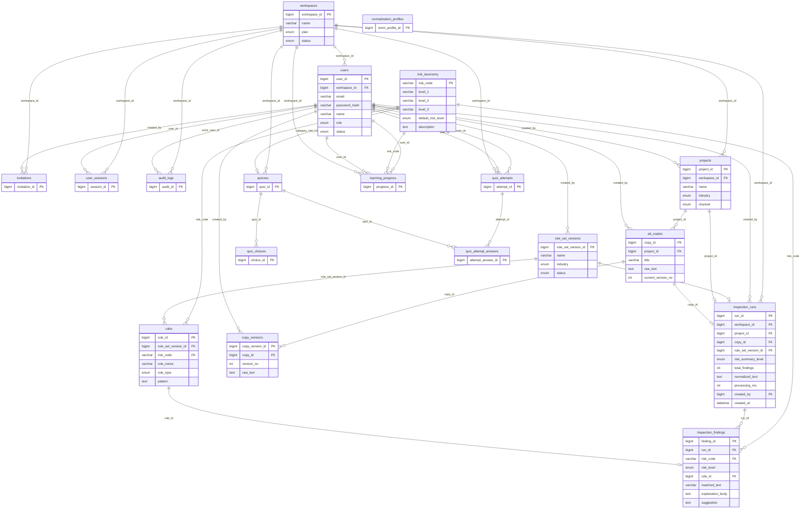

# AdSafe 서비스 ERD 정의서

| 항목 | 내용 |
|------|------|
| **서비스명** | AdSafe (광고 문구 규제 리스크 검수·교육) |
| **DB 스키마** | adsafe_2 (MySQL) |
| **문서 버전** | 1.0 |
| **기준일** | 2026-02-04 |

---

## 1. 개요

본 문서는 AdSafe 서비스의 **데이터베이스 ERD(Entity Relationship Diagram)** 및 **테이블·관계 정의**를 서비스 기준으로 정리한 것이다.  
실제 DDL은 `docs/sql/adsafe_schema_mysql.sql` 에 있으며, 본 서류는 구조 이해·검토·유지보수용으로 사용한다.

---

## 2. 서비스 도메인 구성

| 영역 | 설명 | 주요 테이블 |
|------|------|-------------|
| **A. 어드민/계정** | 조직(워크스페이스), 사용자, 초대, 세션, 감사 로그 | workspaces, users, invitations, user_sessions, audit_logs |
| **B. 제작 모드 (AdSafe)** | 프로젝트·광고 문구·버전 관리 | projects, ad_copies, copy_versions |
| **C. 룰/검수** | 리스크 분류, 룰셋·룰, 검수 실행·적발 결과 | risk_taxonomy, rule_set_versions, rules, inspection_runs, inspection_findings, normalization_profiles |
| **D. 교육 모드 (AduSafe)** | 퀴즈, 풀이 세션·답안, 카테고리별 숙련도 | quizzes, quiz_choices, quiz_attempts, quiz_attempt_answers, learning_progress |

---

## 3. 전체 ERD (Mermaid)

아래는 전체 19개 테이블과 PK/FK 관계를 나타낸 ERD이다.  
[Mermaid Live](https://mermaid.live) 또는 GitHub·VS Code(Mermaid 확장)에서 렌더링할 수 있다.

---

## 4. 테이블 정의 요약 (19개)

### A. 어드민/계정 (5)

| 테이블 | PK | 설명 |
|--------|-----|------|
| workspaces | workspace_id | 조직(테넌트). plan, status |
| users | user_id | 사용자. workspace_id, email, role, status |
| invitations | invitation_id | 사용자 초대. token, status, expires_at |
| user_sessions | session_id | 로그인 세션. session_token, expires_at |
| audit_logs | audit_id | 감사 로그. action, entity_type, entity_id, meta_json |

### B. 제작 모드 (3)

| 테이블 | PK | 설명 |
|--------|-----|------|
| projects | project_id | 프로젝트. workspace_id, industry, channel |
| ad_copies | copy_id | 광고 문구(최신본). project_id, raw_text, current_version_no |
| copy_versions | copy_version_id | 문구 수정 이력. copy_id, version_no, raw_text |

### C. 룰/검수 (6)

| 테이블 | PK | 설명 |
|--------|-----|------|
| risk_taxonomy | risk_code | 리스크 분류. level_1~3, default_risk_level, description |
| rule_set_versions | rule_set_version_id | 룰셋 버전. name, industry, status |
| rules | rule_id | 룰. rule_set_version_id, risk_code, rule_type, pattern |
| inspection_runs | run_id | 검수 실행 1건. workspace_id, risk_summary_level, total_findings, normalized_text, created_by |
| inspection_findings | finding_id | 적발 1건. run_id, risk_code, risk_level, matched_text, explanation_body, suggestion |
| normalization_profiles | norm_profile_id | 전처리 프로필(확장). config_json |

### D. 교육 모드 (5)

| 테이블 | PK | 설명 |
|--------|-----|------|
| quizzes | quiz_id | 문제은행. workspace_id, category_risk_code, difficulty |
| quiz_choices | choice_id | 보기(4지선다). quiz_id, choice_no, is_correct |
| quiz_attempts | attempt_id | 문제풀이 세션. user_id, workspace_id, correct_count |
| quiz_attempt_answers | attempt_answer_id | 문제별 답안. attempt_id, quiz_id, selected_choice_no |
| learning_progress | progress_id | 카테고리별 숙련도. user_id, workspace_id, risk_code, mastery_score |

---

## 5. 현재 서비스에서 사용 중인 흐름

- **검수하기**  
  - 화면: `adsafe.html` → API: `POST /AdSafe/api/inspect`  
  - DB: `inspection_runs` 1건 INSERT → `inspection_findings` N건 INSERT (risk_taxonomy FK)
- **검수 이력 목록**  
  - 화면: `inspection-history.html` → API: `GET /AdSafe/api/inspection-history`  
  - DB: `inspection_runs` 조회 (workspace_id=1 기준)
- **검수 이력 상세**  
  - 화면: `inspection-detail.html` → API: `GET /AdSafe/api/inspection-history/:id`  
  - DB: `inspection_runs` + `inspection_findings` 조회

필수 선행 데이터: `workspaces(1)`, `users(1)`, `risk_taxonomy`(시드 또는 동일 규칙 반영).

---

## 6. 참조

- DDL: `docs/sql/adsafe_schema_mysql.sql`
- ERD 원본(Mermaid): `docs/sql/ERD_adsafe.md`
