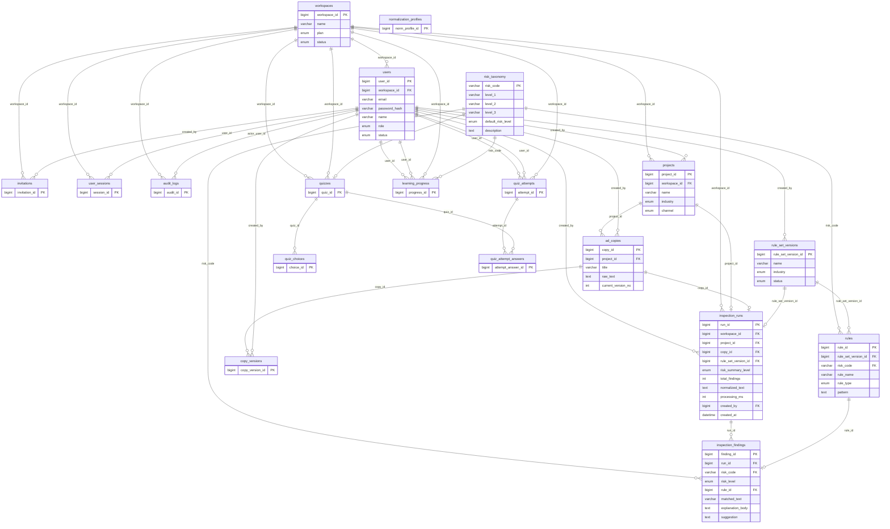

# AdSafe DB ERD (Entity Relationship Diagram)

**ERD** = Entity Relationship Diagram (엔티티·관계 다이어그램)  
테이블(엔티티)과 그 사이의 관계(FK)를 나타낸 구조도입니다.

---

## 전체 ERD (Mermaid)

아래 코드는 [Mermaid](https://mermaid.js.org/) 문법입니다.  
GitHub, Cursor, VS Code(Mermaid 확장), 또는 [mermaid.live](https://mermaid.live)에서 렌더링할 수 있습니다.

---

## 검수하기 버튼과 연결된 테이블 (요약)

| 구분 | 테이블 | 설명 |
|------|--------|------|
| **1** | `inspection_runs` | 검수 실행 1건 (실행일시, 요약 위험도, normalized_text, processing_ms, created_by 등) |
| **2** | `inspection_findings` | 적발 항목 1건씩 (run_id, risk_code, risk_level, matched_text, explanation, suggestion) |

- `inspection_runs` → `workspaces`, `users`(created_by) 참조  
- `inspection_findings` → `inspection_runs`(run_id), `risk_taxonomy`(risk_code) 참조  

---

## 테이블 목록 (19개)

| 영역 | 테이블 |
|------|--------|
| **A. 어드민** | workspaces, users, invitations, user_sessions, audit_logs |
| **B. 제작 모드** | projects, ad_copies, copy_versions |
| **C. 룰/검수** | risk_taxonomy, rule_set_versions, rules, **inspection_runs**, **inspection_findings**, normalization_profiles |
| **D. 교육 모드** | quizzes, quiz_choices, quiz_attempts, quiz_attempt_answers, learning_progress |
